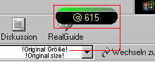



## TwinBeat Tiny Edition

### Description

This is a tool for displaying the .Beat, the internettime by swatch.

Further it has a round shape and it stays on top. Really cool!
 
### More Info
 

             |
---                |---
**Submitted On**   |2000-08-09 16:07:22
**By**             |[TwinWare](https://github.com/Planet-Source-Code/PSCIndex/blob/master/ByAuthor/twinware.md)
**Level**          |Intermediate
**User Rating**    |4.7 (14 globes from 3 users)
**Compatibility**  |VB 6\.0
**Category**       |[Complete Applications](https://github.com/Planet-Source-Code/PSCIndex/blob/master/ByCategory/complete-applications__1-27.md)
**World**          |[Visual Basic](https://github.com/Planet-Source-Code/PSCIndex/blob/master/ByWorld/visual-basic.md)
**Archive File**   |[CODE\_UPLOAD88908122000\.zip](https://github.com/Planet-Source-Code/twinware-twinbeat-tiny-edition__1-10626/archive/master.zip)

